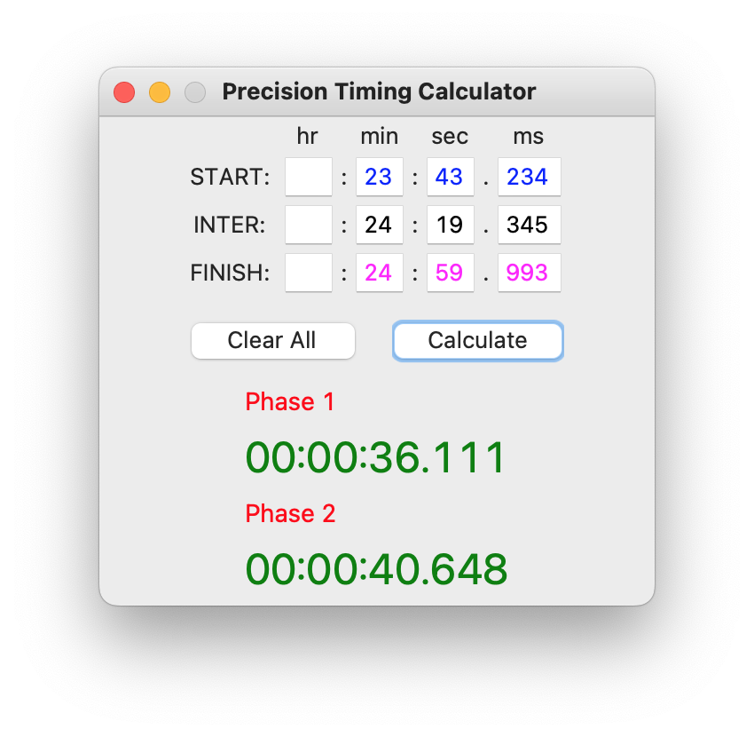

# :clock5: Chronos: a high precision timing calculator. 

Simple module and GUI implementing a high precision (millisecond) timing calculator to assist in auditing and 
correcting timing results for show-jumping competitions.

- To get started run `python chronos_gui.py` in a terminal.
- All dependencies are included in Python's standard library.

Last updated by Jeffrey Koppanyi on 23/11/23

